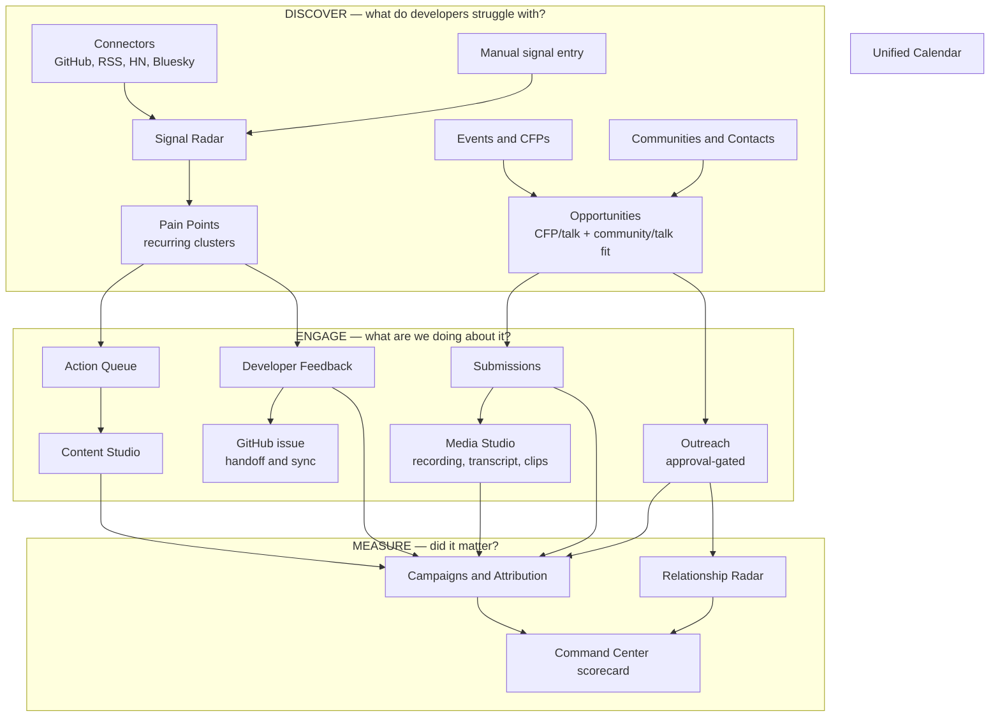

# DevRelOS Workflow Guide

How the platform is meant to be used, and how work flows between its surfaces.

This is the **task-oriented** companion to the [Operator Guide](OPERATOR_GUIDE.md).
The Operator Guide is a reference: it documents every workspace, field and setting
one at a time. This guide answers the questions a reference cannot:

- Which mode am I running in, and what does that change?
- What does a day and a week of DevRelOS actually look like?
- When I record something here, where does it show up next?
- How does a developer complaint become a measurable outcome?

If you want per-field detail on a specific workspace, go to the Operator Guide.
If you want to know what to *do*, start here.

---

## 1. Two operating modes

DevRelOS runs in one of two modes, and almost every "why can't I…" question traces
back to which one is active. Both are self-hosted; neither is a hosted SaaS.

### Single-operator local mode (the default)

```bash
cp .env.example .env
make up            # then open http://localhost:3000
```

- `DEVRELOS_WEB_SESSIONS=false`, `DEVRELOS_REQUIRE_AUTH=false`, no API token.
- There is no login screen. You are the operator, with full access.
- Everything lands in the workspace with slug `default` and its default project.
- Postgres, the API and the web UI all bind to `127.0.0.1` only. Nothing is
  reachable from your network.

This is the mode to use for a single DevRel person or a local trial. It is the
mode the quickstart assumes.

### Multi-user mode

Set these and restart:

| Variable | Value | Effect |
| --- | --- | --- |
| `DEVRELOS_WEB_SESSIONS` | `true` | Enables the login screen and browser sessions |
| `DEVRELOS_REQUIRE_AUTH` | `true` | The API rejects unauthenticated requests |
| `DEVRELOS_API_TOKEN` | a strong secret | Bootstrap operator credential |
| `DEVRELOS_SECRET_KEY` | `openssl rand -base64 32` | Encrypts stored connector secrets |

Now you get users, four roles (`viewer` → `editor` → `admin` → `owner`),
email invitations, revocable API keys, per-workspace encrypted secrets, workspace
switching and audit events. Writes require at least `editor`.

> **Pick a mode deliberately.** Multi-user mode is the more thoroughly exercised
> path in CI, but it adds a login, role checks and invitation management that a
> solo operator does not need. Local mode is simpler and has fewer moving parts.

Production deployment (Caddy, HTTPS, a public domain) is documented in
[Operator Guide §3](OPERATOR_GUIDE.md) and always implies multi-user mode.

---

## 2. The mental model

DevRelOS is built around three loops. The value is not in any single workspace —
it is in the fact that a record created in one loop carries its provenance into
the next, so the last loop can attribute outcomes back to the first.



Two things hold it together:

**Provenance.** A work item created from a pain point stores `sourceType:
"pain_point"` and the pain point's id. A feedback item does the same. So when
someone asks "why are we writing this blog post?", the answer is a list of
developer signals, not a hunch.

**Attribution.** A campaign can claim ten kinds of record — `content_asset`,
`work_item`, `event`, `cfp`, `submission`, `outreach`, `feedback`, `media_asset`,
`community`, `talk` — and derives an outcome score from what those records
actually did.

---

## 3. Your first outcome

Roughly fifteen minutes, no external integrations required. This exercises the
full loop so you can see how the pieces connect before wiring up connectors.

1. **Talk Library** → add one talk you can actually give. Give it real topics
   (`kubernetes`, `platform engineering`) — topic strings drive every fit score.
2. **Events & CFPs** → add one event and its CFP, with a real `closesAt` date.
3. **Opportunities** → you now see a scored CFP/talk match with an inspectable
   breakdown (topic fit, community quality, relationship, talk readiness,
   timing). Nothing here is a black box; open the reasons.
4. **Events & CFPs** → create a submission from that match. It starts at `draft`.
5. **Community Graph** → add a community and a relationship for its organizer,
   with a follow-up date.
6. **Calendar** → the CFP deadline, the event and the follow-up are all there.
7. **Signal Radar** → add a manual signal describing a real developer complaint.
   Add several similar ones and a pain-point cluster forms.
8. **Action Queue** or **Developer Feedback** → convert the pain point. Action
   Queue is for work you will do; Developer Feedback is for the product team.
9. **Content Studio** → create a content asset from the Action Queue item. Its
   brief carries the supporting signals as evidence.
10. **Campaigns** → create a campaign and attribute the content, the work item
    and the submission to it. The Command Center now shows an outcome score.

---

## 4. The five workflow chains

Each chain is a path through the loops. These are the paths the data model is
designed for; anything else will feel like fighting the tool.

### A. Developer pain → content

```
signals → pain point cluster → Action Queue item → content brief → draft → review → published → campaign
```

Statuses: work items move `backlog → planned → in_progress → blocked → done →
cancelled`. Content assets move `brief → drafting → review → approved →
published → archived`.

The point of the chain is that the published post cites the signals that
justified it. Skip Signal Radar and you lose the evidence.

### B. Developer pain → product feedback

```
signals → pain point → feedback item → GitHub issue → linked sync → shipped → tell the developer
```

Statuses: `new → triaged → planned → in_progress → shipped → closed / wont_fix`.

Feedback items prefill a GitHub issue and then sync state from the linked public
issue. The last step — going back to the developer who raised it — is what makes
this a DevRel loop rather than a bug tracker. `shipped` is not the end.

### C. CFP discovery → accepted talk

```
event + CFP → CFP/talk fit score → submission → submitted → accepted → delivered → recording → clips → content
```

Statuses: `draft → needs_work → ready → submitted → accepted / rejected /
withdrawn`.

After the talk, Media Studio takes the recording and transcript, proposes clip
candidates, and renders approved clips with FFmpeg. Clips become content assets,
which re-enter chain A.

### D. Community → speaking relationship

```
community → contact → relationship → outreach draft → human approval → send → touchpoint → relationship health
```

Outreach is **approval-gated by design**: nothing sends without an explicit human
approval step, and SMTP delivery stays disabled until configured. Relationship
Radar then surfaces decaying relationships and overdue follow-ups, which land
back on the Calendar.

Relationship stages: `cold → warm → engaged → partner`.

### E. Campaign execution

```
campaign → attribute activity → derived outcomes → manual metrics → outcome score
```

Attribution is the measurement layer. Attribute as you work rather than
reconstructing it at quarter end — one-click attribution exists on content, work
items, outreach and feedback for exactly this reason.

---

## 5. The Calendar is where everything converges

The Unified Calendar is the one surface that reads from all the others. It shows
seven kinds of item:

| Kind | Comes from |
| --- | --- |
| `cfp` | CFP submission deadlines |
| `event` | Event start dates |
| `work_item` | Action Queue due dates |
| `content` | Scheduled content |
| `campaign_start` | Campaign start dates |
| `campaign_end` | Campaign end dates |
| `relationship_follow_up` | Relationship follow-up commitments |

If something you care about is not on the Calendar, it has no date on it — which
usually means it will be missed. Adding dates is what makes the Calendar useful.

---

## 6. Automation

### Connectors

Register a provider in **Integrations**, give it a schedule (roughly every 15
minutes through weekly), and the worker polls it. Available providers: GitHub
Issues, GitHub Discussions, GitHub Releases, RSS/Atom, Hacker News, Bluesky,
developers.events.

Credentials belong in **Access & Security** as encrypted workspace secrets, not
in environment variables. Run history and failures are visible per connector.

Signal clustering is a **deterministic keyword heuristic**, not an LLM — cluster
rebuilds are reproducible and the whole product works offline. The trade-off is
that the topic and friction vocabularies are compiled in, and they are tuned for
platform engineering, Kubernetes, CI/CD, observability and developer experience.
Signals outside those domains will cluster poorly until the rules are extended in
`internal/intelligence/signals/clustering.go`.

### MCP

The MCP server exposes the domain API as authenticated agent/IDE tools, so an
agent can list events, CFPs, talks, communities, outreach, opportunities and
campaigns without database access. See [MCP.md](MCP.md).

---

## 7. Operating rhythm

A condensed version of [Operator Guide §23](OPERATOR_GUIDE.md).

**Daily (10 minutes).** Command Center for deadline and relationship risk. Triage
new signals. Clear anything the Calendar says is due today.

**Twice a week (30 minutes).** Review pain-point clusters and convert the
significant ones. Advance submissions. Approve or reject pending outreach.

**Weekly (an hour).** Work the Opportunities queue. Review Relationship Radar for
decay. Move content along its pipeline. Attribute the week's activity to
campaigns.

**Monthly.** Review campaign outcome scores. Check feedback closure rate. Retire
stale talks. Prune connectors that produce noise.

---

## 8. Where to go next

| Question | Document |
| --- | --- |
| How does workspace X work, field by field? | [OPERATOR_GUIDE.md](OPERATOR_GUIDE.md) |
| How do I run it locally or in production? | [RUNNING.md](RUNNING.md) |
| How is the system put together? | [ARCHITECTURE.md](ARCHITECTURE.md) |
| What is the security model? | [SECURITY.md](SECURITY.md) |
| Which connectors exist and how do I configure them? | [INTEGRATIONS.md](INTEGRATIONS.md) |
| How do agents and IDEs connect? | [MCP.md](MCP.md) |
| What is the product thesis? | [PRODUCT.md](PRODUCT.md) |
| What is planned? | [ROADMAP.md](ROADMAP.md) |
